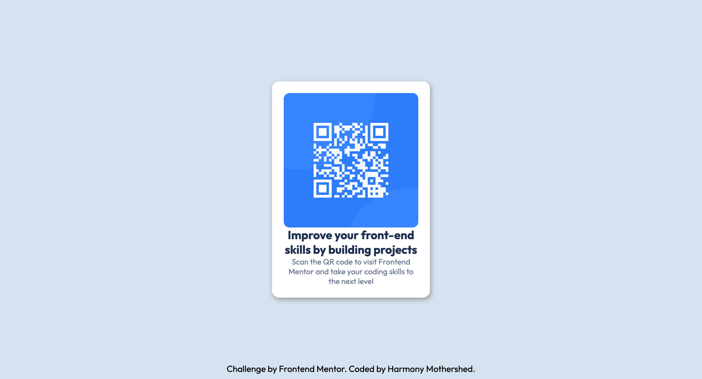

# Frontend Mentor - QR code component solution

This is a solution to the [QR code component challenge on Frontend Mentor](https://www.frontendmentor.io/challenges/qr-code-component-iux_sIO_H). 

### Screenshot

### Links
[Solution URL](https://github.com/hmothershed/qr-code-component)
  
[Live Site URL](https://hmothershed.github.io/qr-code-component/)
### Built with
- Semantic HTML5 markup
- CSS custom properties
- Flexbox
- CSS Grid
- Mobile-first workflow

### So umm I noticed that I've been doing these challenges out of order based off of the learning paths...

  

### but anywho, at least I'm attempting them and they're getting done right?🤣 

## Author

- Frontend Mentor - [@hmothershed](https://www.frontendmentor.io/profile/hmothershed)

